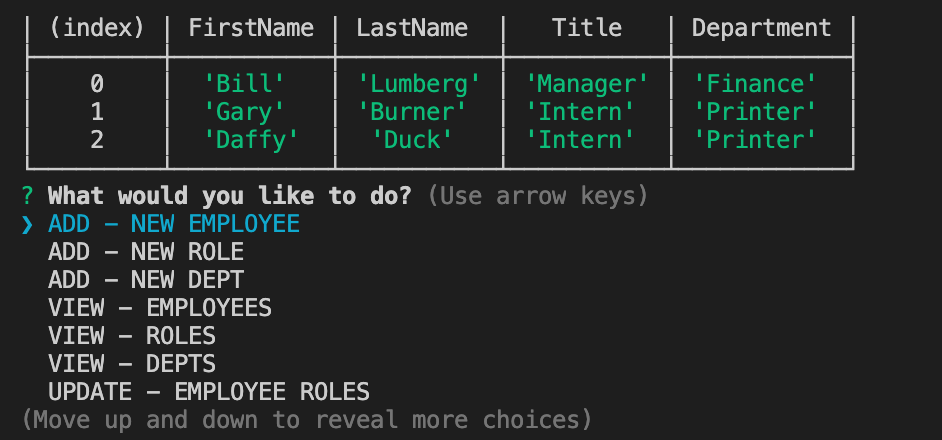

# Project Name: Employee Database Manager


[](https://opensource.org/licenses/MIT)

## Author: grburner


<p align="center">
  
</p>

## Table of Contents
<!--ts-->
1. [ Project Description ](#desc)
2. [ Installation Instructions ](#inst)
3. [ Usage Information ](#use)
4. [ Contribution Guidelines ](#guide)
5. [ Test Instructions ](#test)
6. [ License Type ](#l-type)
7. [ Questions | Email me ](#email)


<!--te-->
<a name="desc"></a>
## 1. Project Description

A simple MYSQL database with functionality to add, update, and delete records.
<a name="inst"></a>
## 2. Installation Instructions

 Run the schema.sql and seeds.sql file in Workbench to set up the database. Install:
 
 ```
npm mysql & npm inquirer
```
 
 Then you can run app.js in Node to go through the inquirer prompts and work with the data.

<a name="use"></a>
## 3. Usage Information

 The workflow in the inquirer prompt will guide you through all of the use cases.

<a name="guide"></a>
## 4. Contribution Guidelines

 Please reach me on my github account to suggest any improvements!

<a name="test"></a>
## 5. Test Instructions

 no testing is built in just yet...

<a name="l-type"></a>
## 6. License Type

 Licensed under the [MIT](license/mit.txt) license.

<a name="email"></a>
## 7. Questions? Email me @:

[grburner@gmail.com](mailto:grburner@gmail.com) or find me on [GitHub](https://github.com/grburner)
